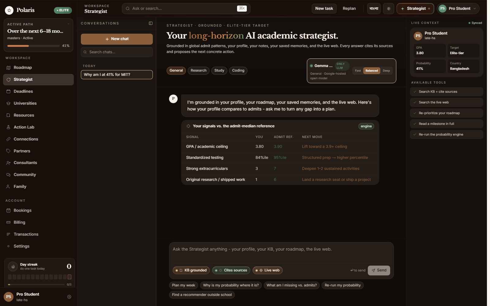
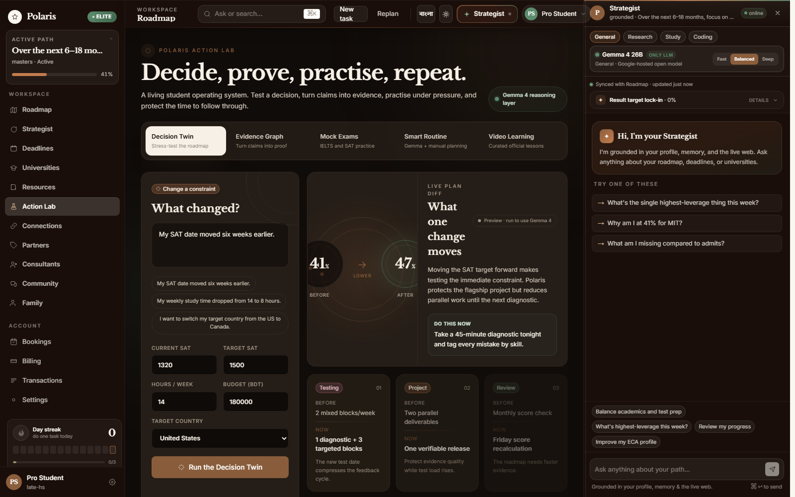
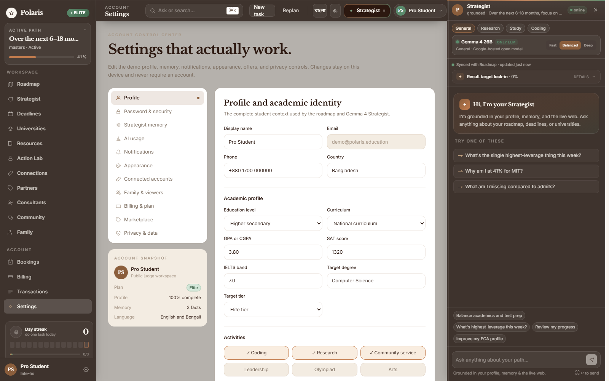
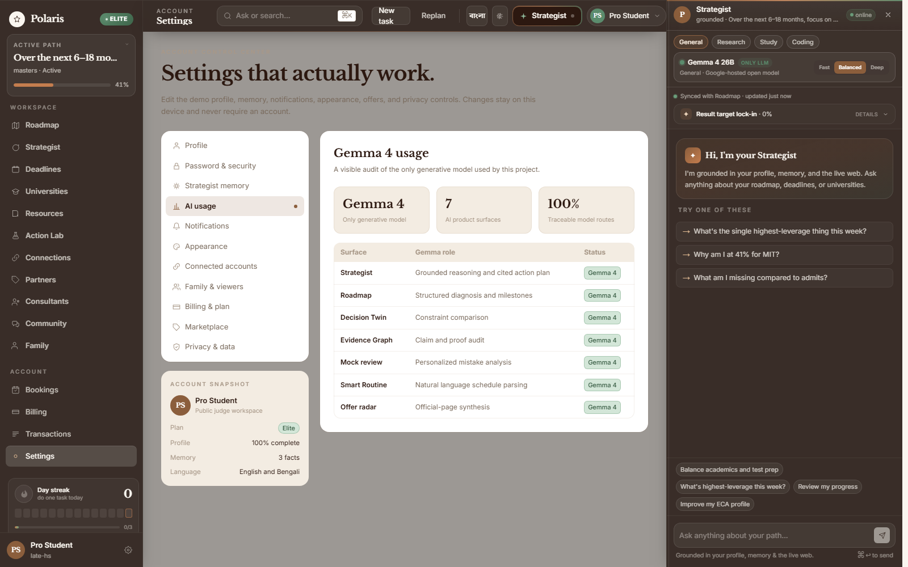
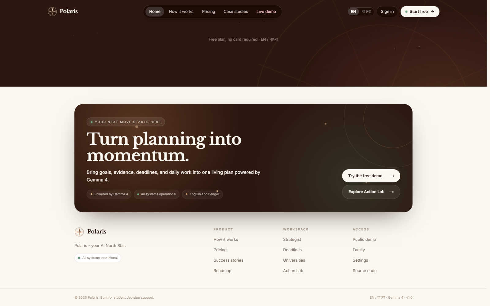
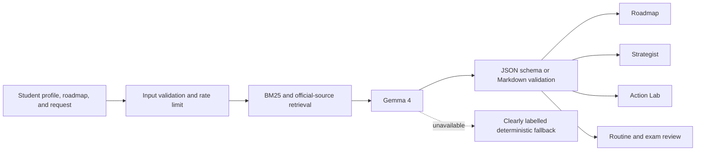

<p align="center">
  
</p>

<h1 align="center">Polaris</h1>

<p align="center">
  <strong>A Gemma 4 academic strategist that turns ambition into an evidence-backed plan a student can act on today.</strong>
</p>

<p align="center">
  <a href="https://polaris-gemma4.vercel.app/">Product site</a> ·
  <a href="https://polaris-gemma4.vercel.app/demo">Public judge workspace</a> ·
  <a href="https://polaris-gemma4.vercel.app/demo/action-lab">Action Lab</a> ·
  <a href="notebooks/polaris_gemma4_decision_lab.ipynb">Executed Kaggle notebook</a> ·
  <a href="KAGGLE_WRITEUP.md">Kaggle writeup</a>
</p>

## Why Polaris exists

University applicants have more information than ever, but very little of it becomes a reliable weekly plan. Requirements live across university pages, scholarship rules, test calendars, saved notes, family expectations, and scattered advice. Students still have to decide what matters now, what evidence is missing, and what should change when a deadline moves.

Polaris closes that planning gap. It combines a student profile, goals, constraints, deadlines, and retrieved evidence. Gemma 4 then turns that context into a measurable roadmap, explains trade-offs, and keeps the plan responsive as the student progresses.

The competition workspace is public. Judges can use every feature without creating an account, entering a card, or enabling a paid plan.

## Product in action

### A living roadmap


The roadmap connects a long-term goal to phases, milestones, deadlines, evidence, and visible progress. The Gemma 4 Strategist stays synchronized with the active mission instead of acting like a separate chatbot.

<table>
  <tr>
    <td width="50%">
      
      <br />
      <strong>Grounded Strategist</strong><br />
      Profile context, retrieved sources, roadmap state, model trace, and one concrete next move in a compact command surface.
    </td>
    <td width="50%">
      
      <br />
      <strong>Action Lab</strong><br />
      Decision Twin, Evidence Graph, mock exams, Smart Routine, and official video learning in one workspace.
    </td>
  </tr>
</table>

### Settings and model transparency that work in the public demo

<table>
  <tr>
    <td width="50%">
      
      <br />
      <strong>Editable student context</strong><br />
      Profile, curriculum, scores, goals, target tier, and activities persist safely on the judge's device.
    </td>
    <td width="50%">
      
      <br />
      <strong>Visible Gemma 4 usage</strong><br />
      Every generative surface is listed with its purpose. No second language model is registered in the runtime.
    </td>
  </tr>
</table>

### The wider student workspace

<table>
  <tr>
    <td width="33%"><br /><strong>University fit</strong><br />Transparent factors and scenario testing.</td>
    <td width="33%"><br /><strong>Risk-aware deadlines</strong><br />Urgency windows and task tracking.</td>
    <td width="33%"><br /><strong>Knowledge hub</strong><br />Scholarships, costs, exams, and student paths.</td>
  </tr>
</table>

### Bengali from landing page to generated guidance


Navigation, landing content, roadmap copy, error states, form labels, fallback guidance, and generated responses support Bengali. Proper names, university names, URLs, code, formulas, and established acronyms such as SAT, IELTS, GPA, and HSC remain unchanged when translation would reduce clarity.

### A polished bilingual finish



The landing experience uses the same visual language as the product. The footer is responsive, bilingual, animated with restrained motion, and links directly into the public product surfaces.

## What makes the project different

Polaris does not stop at generating advice. It creates an execution loop:

1. **Decide:** Decision Twin stress-tests a changed score, deadline, budget, country, or available study time.
2. **Prove:** Evidence-to-Action Graph separates a claim from proof and names the missing verification.
3. **Practise:** IELTS and SAT mini mocks score original questions deterministically, then Gemma 4 creates the recovery focus.
4. **Schedule:** Smart Routine converts plain language into a validated, editable weekly block.
5. **Learn:** Curated IELTS and SAT lessons play inside the workspace with related official resources.
6. **Adapt:** New evidence, completed work, and deadline changes flow back into the roadmap.

This makes Gemma 4 part of the student's operating system, not an isolated text box.

## How Gemma 4 is used

Gemma 4 is the only generative model in Polaris. Deterministic retrieval, scoring, validation, and storage support it, but none of those systems replace its central reasoning role.



| Product surface | Input given to Gemma 4 | Model responsibility | Validation before display |
| --- | --- | --- | --- |
| Roadmap generation | Student stage, goals, gaps, constraints, and retrieved evidence | Diagnose the profile and produce focused milestones | Shallow JSON schemas, required fields, retry, deterministic assembly |
| Strategist | Profile, live roadmap state, current mission, memory, and top sources | Explain trade-offs and propose the next measurable action | Safe Markdown renderer, citation mapping, formula normalization |
| Research mode | Student question and ranked official evidence | Compare evidence in the student's context | Source allowlist and visible citations |
| Decision Twin | Baseline plan plus one changed constraint | Explain what moves and why | Strict probability, risk, focus, action, and evidence contract |
| Evidence Graph | Claim, proof type, and supplied detail | Identify signal, gap, next action, and verification | Unsupported claims never become verified automatically |
| Mock exam review | Deterministic score and weak skills | Produce a concise three-step recovery plan | Original questions, auditable scoring, bounded response length |
| Smart Routine | Natural-language schedule request and existing blocks | Parse day, time, title, and category | Day and category enums, 24-hour time checks, editable confirmation |
| Student offer radar | Retrieved official offer pages | Summarize eligibility and why an offer fits | Official URL validation, timestamps, and visible model trace |
| Student memory | Completed conversation and explicit preferences | Extract durable goals, constraints, and preferences | User-visible memory controls with add, forget, and clear actions |

The enforcement boundary lives in:

- [`lib/llm/gemma.ts`](lib/llm/gemma.ts), which allowlists Gemma 4 model IDs and owns generation;
- [`lib/llm/providers/registry.ts`](lib/llm/providers/registry.ts), which registers the single generative provider;
- [`lib/llm/router.ts`](lib/llm/router.ts), which rejects unsupported routing choices;
- [`app/api/action-lab/route.ts`](app/api/action-lab/route.ts), which validates every structured Action Lab response;
- [`components/app/MarkdownMessage.tsx`](components/app/MarkdownMessage.tsx), which keeps Markdown, tables, code, and formulas readable.

## Executed Kaggle notebook

[`notebooks/polaris_gemma4_decision_lab.ipynb`](notebooks/polaris_gemma4_decision_lab.ipynb) is an executed, judge-readable companion to the live app. It includes:

- the fixed Gemma 4 model allowlist and hidden-secret setup;
- inspectable retrieval for a Bangladesh-context student;
- structured Decision Twin and Evidence Graph outputs;
- a Gemma 4 Smart Routine parse;
- adaptive SAT review;
- Bengali structured generation;
- 8 automated contract checks with recorded outputs;
- a direct mapping from notebook cells to live product surfaces.

No credential value is stored in the notebook.

## Supporting systems

| Component | Purpose |
| --- | --- |
| Gemma 4 | Central reasoning, planning, synthesis, routine parsing, review, and memory extraction |
| BM25 retrieval | Ranks curated university, scholarship, and admissions evidence |
| Official web retrieval | Supplies current public facts without adding another generative model |
| Transparent scoring | Produces directional university-fit estimates and factor contributions |
| Zod and JSON Schema | Validate public inputs and structured model outputs |
| MongoDB | Stores real account profiles, roadmaps, progress, and conversations |
| Browser-local demo state | Makes public profile and settings controls functional without authentication |

## Run locally

### Requirements

- Node.js 20 or newer
- pnpm 11 or newer
- a Google AI Studio API key with access to an allowlisted Gemma 4 model

```bash
pnpm install
cp .env.local.example .env.local
pnpm dev
```

On Windows PowerShell, use `Copy-Item .env.local.example .env.local` instead of `cp`.

Set `GEMMA_API_KEY` in `.env.local`, then open [http://localhost:3000/demo](http://localhost:3000/demo).

### Configuration

| Variable | Required | Purpose |
| --- | --- | --- |
| `GEMMA_API_KEY` | For live generation | Server-side Gemma 4 credential |
| `GEMMA_MODEL` | No | Selects a model from the server allowlist |
| `TAVILY_API_KEY` | No | Adds non-generative live-web retrieval in Research mode |
| `MONGODB_URI` | Account workspace only | Profile, roadmap, progress, and conversation storage |
| `NEXTAUTH_SECRET` | Account workspace only | Session security |
| `NEXTAUTH_URL` | Account workspace only | Authentication callback base URL |

The public `/demo` route does not require MongoDB, authentication, or payment configuration.

## Project map

```text
app/demo/                    Public judge workspace
app/api/demo/                Public roadmap and Strategist APIs
app/api/action-lab/          Decision, evidence, exam, and routine contracts
components/app/              Product workspace and model response surfaces
components/demo/             Browser-local public demo controls
data/                        Curated university, scholarship, and case-study evidence
notebooks/                   Executed Gemma 4 Kaggle notebook
lib/action-lab/              Typed exams, routines, videos, and results
lib/i18n/                    English and Bengali localization
lib/llm/                     Gemma 4 client and routing boundary
lib/ml/                      Transparent admissions-fit scoring
lib/rag/                     Deterministic evidence retrieval
lib/roadmap/                 Roadmap generation, schemas, and state
```

## Validation

```bash
pnpm exec tsc --noEmit
pnpm lint
pnpm build
```

The final responsive check covers the landing page, full-page Strategist, 416px right rail, Action Lab, functional profile/settings tabs, and English/Bengali workspace states.

## Responsible use

Polaris provides planning support, not admission guarantees. Fit estimates are directional. High-stakes decisions should be checked against official university, scholarship, exam, and visa sources. The scoring system excludes demographic proxies, and model responses never expose hidden reasoning.

## Team

Built for the **Build with Gemma: ML, AI, Deep Learning & NLP Community Hackathon** in Bangladesh.

- **Imtiaz Hossain**
- **Mofftasim Hossain Sayem**