<p align="center">
  
</p>

<h1 align="center">Polaris</h1>

<p align="center">
  <strong>A Bengali-first Gemma 4 strategist that helps students start early, prove progress, and turn global education goals into weekly action.</strong>
</p>

<p align="center">
  <a href="https://polaris-gemma4.vercel.app/">Product site</a> ·
  <a href="https://polaris-gemma4.vercel.app/demo">Public judge workspace</a> ·
  <a href="https://polaris-gemma4.vercel.app/demo/action-lab">Action Lab</a> ·
  <a href="notebooks/polaris_gemma4_decision_lab.ipynb">Executed Kaggle notebook</a> ·
  <a href="KAGGLE_WRITEUP.md">Kaggle writeup</a>
</p>

## Why Polaris exists

A Bangladeshi student can reach HSC, open a scholarship or university application, and discover that the strongest preparation should have started years earlier. Tests need months of practice. Competitive applications ask for sustained projects, leadership, and evidence of impact. Important deadlines may already be close. The ambition was always there; the roadmap arrived too late.

Polaris is built to close that timing gap. It helps students start as early as Class 5, 7, or 8 with a connected view of academic growth, Olympiads, hackathons, community projects, English preparation, scholarships, and future deadlines. Gemma 4 turns the student's profile, goals, constraints, evidence, and retrieved sources into a measurable roadmap, then keeps the plan responsive as the student progresses.

The competition workspace is public. Judges can use every feature without creating an account, entering a card, or enabling a paid plan.

## Product in action

### A living roadmap

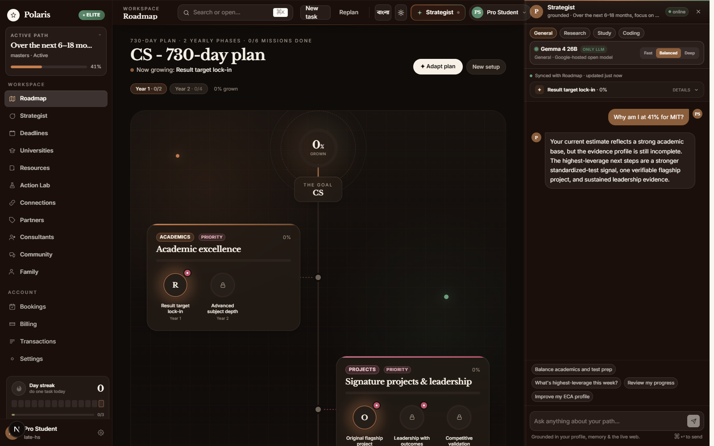

The roadmap connects a long-term goal to phases, milestones, deadlines, evidence, and visible progress. The Gemma 4 Strategist stays synchronized with the active mission instead of acting like a separate chatbot.

<table>
  <tr>
    <td width="50%">
      
      <br />
      <strong>Grounded Strategist</strong><br />
      Profile context, retrieved sources, roadmap state, model trace, and one concrete next move in a compact command surface.
    </td>
    <td width="50%">
      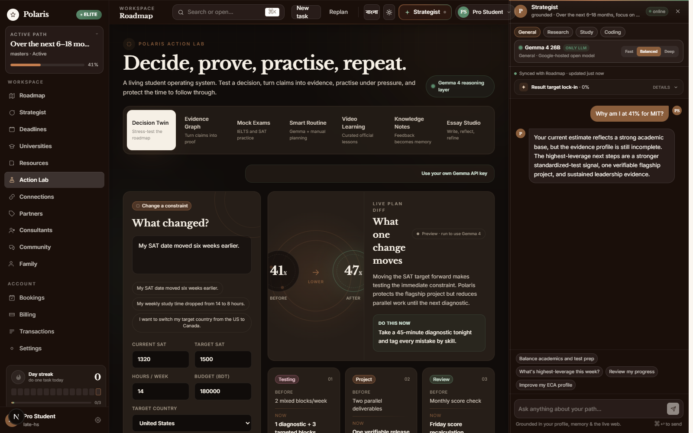
      <br />
      <strong>Action Lab</strong><br />
      Decision Twin, Evidence Graph, fresh Gemma mocks, Smart Routine, video discovery, knowledge notes, and a multimodal Essay Studio in one workspace.
    </td>
  </tr>
</table>

### Gemma 4 inside the execution loop

<table>
  <tr>
    <td width="50%">
      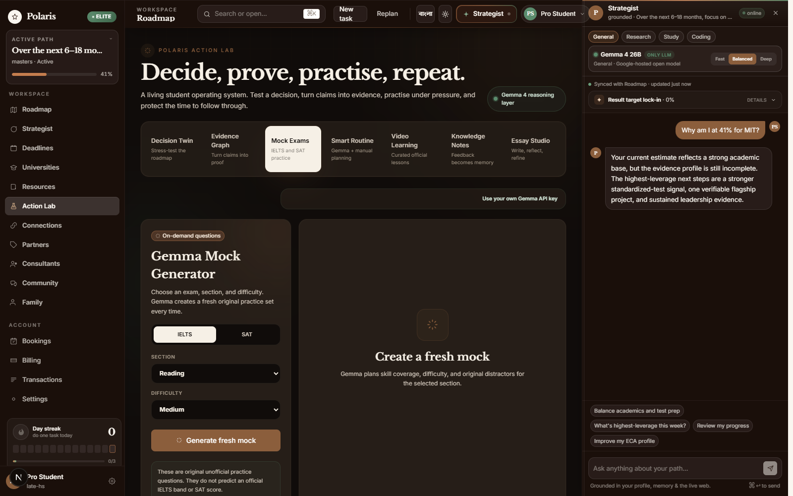
      <br />
      <strong>Fresh mock generation and grading</strong><br />
      Gemma 4 creates a new original three-question IELTS or SAT diagnostic for the selected section and difficulty. Deterministic scoring stays auditable, then Gemma 4 diagnoses the error pattern and prescribes the next practice block.
    </td>
    <td width="50%">
      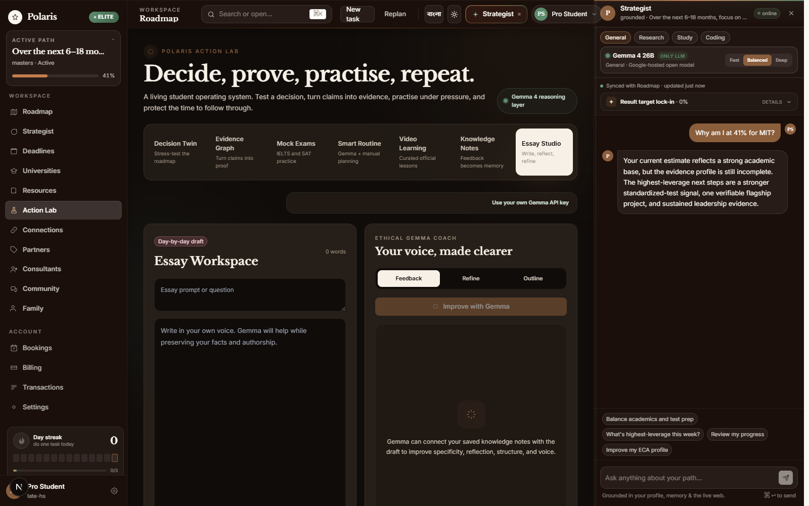
      <br />
      <strong>Essay Studio and knowledge notes</strong><br />
      Drafts autosave in the browser. Gemma 4 gives voice-preserving feedback, creates outlines, and turns saved feedback into reusable knowledge for both Strategist surfaces.
    </td>
  </tr>
  <tr>
    <td width="50%">
      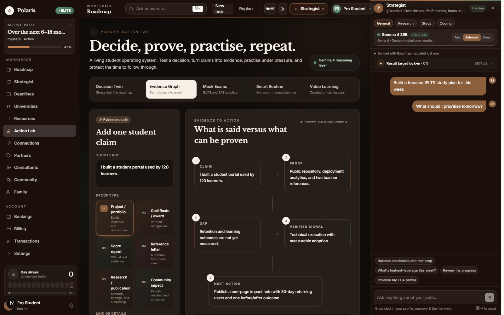
      <br />
      <strong>Evidence-to-Action Graph</strong><br />
      Gemma 4 separates a student claim from its proof, identifies missing verification, and returns the next evidence action.
    </td>
    <td width="50%">
      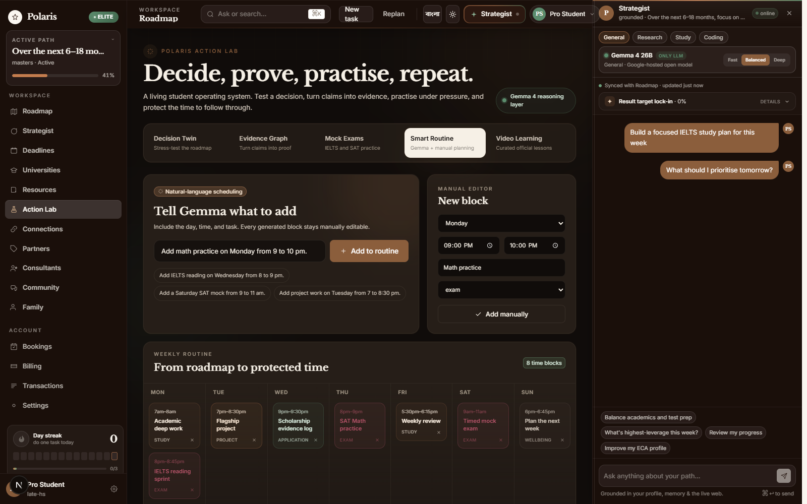
      <br />
      <strong>Smart Routine</strong><br />
      Natural-language schedule requests become validated, editable weekly blocks while manual control remains available.
    </td>
  </tr>
</table>

### Section-aware video learning inside Polaris

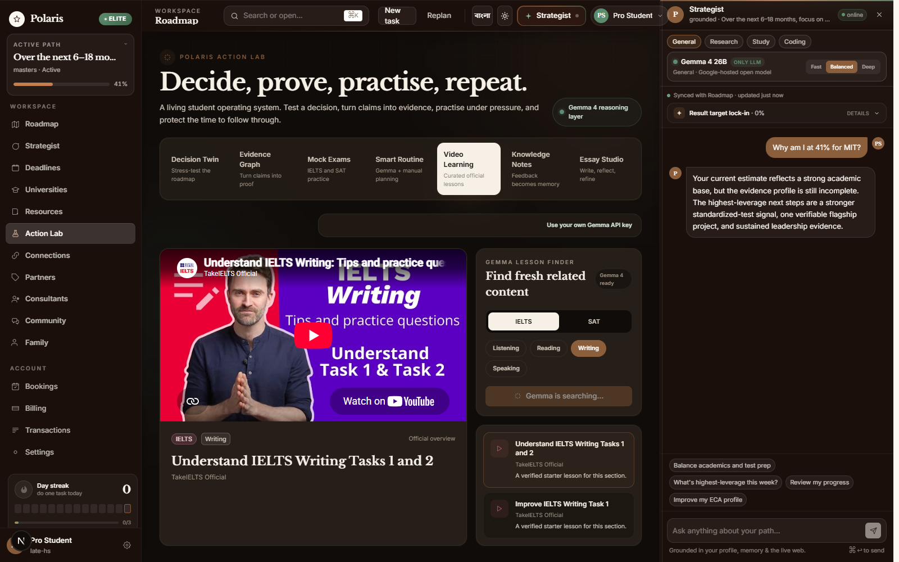

Each IELTS and Digital SAT section begins with its own verified starter playlist. Clicking a lesson changes and starts the privacy-enhanced embedded player. Refresh with Gemma uses retrieved evidence to explain and surface three verified lessons for the selected skill without inventing a direct video URL.
### Handwriting to a bilingual essay draft

<table>
  <tr>
    <td width="50%">
      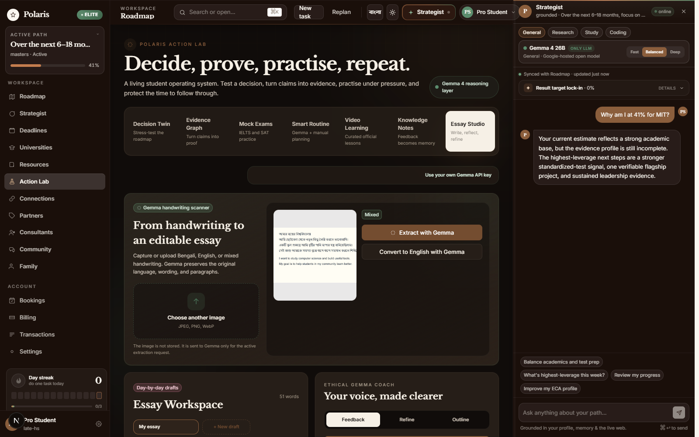
      <br />
      <strong>Gemma 4 multimodal transcription</strong><br />
      A student can photograph or upload a handwritten Bengali, English, or mixed-language essay. The browser resizes the active image, sends it only to Gemma 4, and never stores the image in the draft collection.
    </td>
    <td width="50%">
      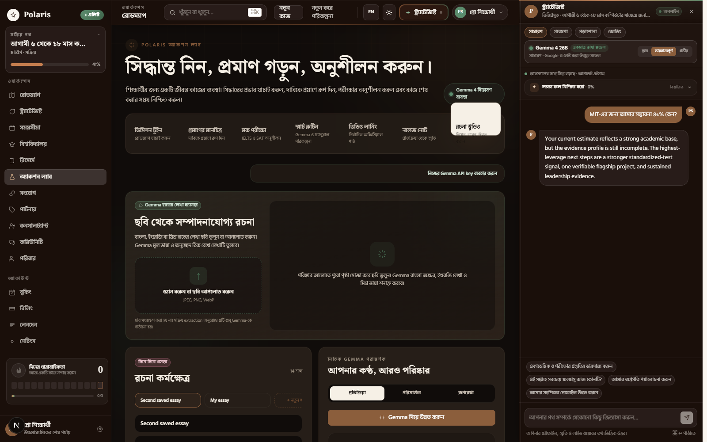
      <br />
      <strong>Bengali first, English by choice</strong><br />
      Gemma first preserves the original language and paragraph structure. A separate control creates a faithful English translation that the student can keep as another named draft. New drafts never overwrite earlier work.
    </td>
  </tr>
</table>
### Evidence-grounded discovery that can refresh

<table>
  <tr>
    <td width="50%">
      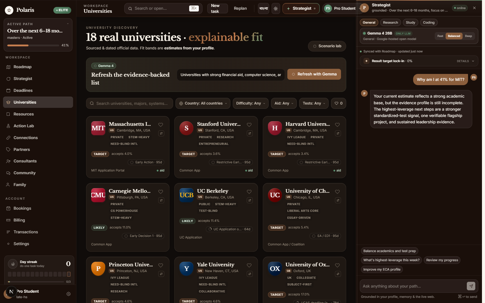
      <br />
      <strong>University and resource refresh</strong><br />
      Students can ask Gemma 4 to synthesize new recommendations from retrieved evidence. The contract prohibits invented rankings, costs, offers, admission rates, and outcomes.
    </td>
    <td width="50%">
      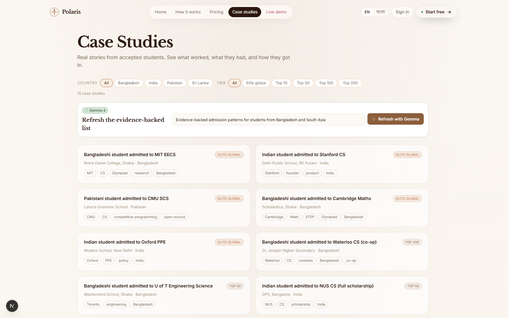
      <br />
      <strong>Case-study pattern finder</strong><br />
      Gemma 4 turns evidence-backed student paths into relevant patterns and a specific next action without changing official institution names.
    </td>
  </tr>
</table>

### Bengali mock generation and feedback

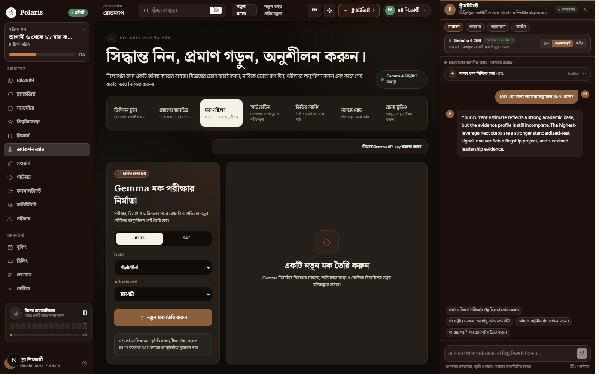

The new generation surfaces follow the same Bengali contract as the Strategist. Ordinary headings, instructions, explanations, errors, and actions use natural Bengali. Official names and established exam abbreviations such as Gemma, IELTS, SAT, and GPA remain unchanged.

### One history across both Strategists

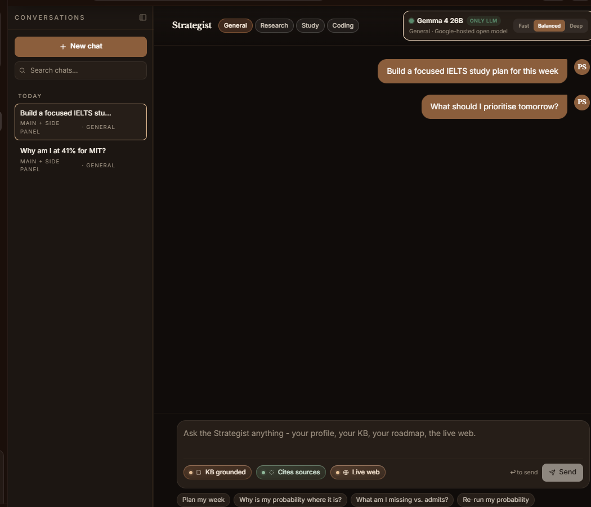

The full-page Strategist and the right-side Strategist now write to the same searchable history. Each public-workspace thread records whether it was used in the main surface, the side panel, or both, and keeps its messages across refreshes in browser storage with an in-memory fallback.

### Settings and model transparency that work in the public workspace

<table>
  <tr>
    <td width="50%">
      
      <br />
      <strong>Editable student context</strong><br />
      Profile, curriculum, scores, goals, target tier, and activities persist safely on the judge's device.
    </td>
    <td width="50%">
      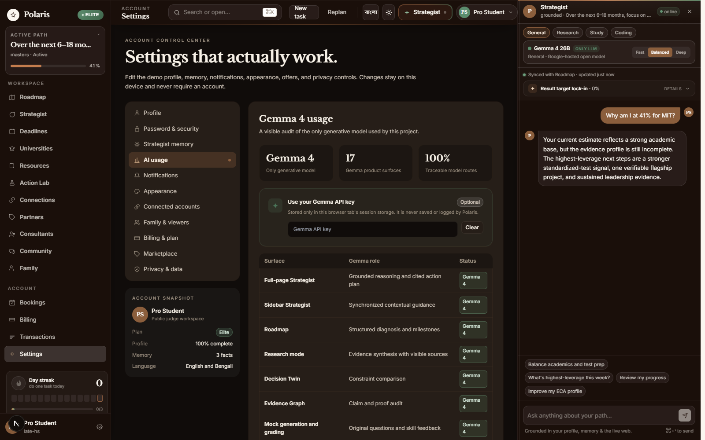
      <br />
      <strong>Visible Gemma 4 usage</strong><br />
      Every generative surface is listed with its purpose. No second language model is registered in the runtime.
    </td>
  </tr>
</table>

### The wider student workspace

<table>
  <tr>
    <td width="33%"><br /><strong>University fit</strong><br />Transparent factors, scenario testing, and evidence-grounded Gemma refresh.</td>
    <td width="33%"><br /><strong>Risk-aware deadlines</strong><br />Urgency windows and task tracking.</td>
    <td width="33%"><br /><strong>Knowledge hub</strong><br />Scholarships, costs, exams, and student paths.</td>
  </tr>
</table>

### Bengali from landing page to generated guidance


Navigation, landing content, roadmap copy, error states, form labels, fallback guidance, and generated responses support Bengali. Proper names, university names, URLs, code, formulas, and established acronyms such as SAT, IELTS, GPA, and HSC remain unchanged when translation would reduce clarity.

### A polished bilingual finish


The landing experience uses the same visual language as the product. The footer is responsive, bilingual, animated with restrained motion, and links directly into the public product surfaces.

## What makes the project different

Polaris does not stop at generating advice. It creates an execution loop:

1. **Decide:** Decision Twin stress-tests a changed score, deadline, budget, country, or available study time.
2. **Prove:** Evidence-to-Action Graph separates a claim from proof and names the missing verification.
3. **Practise:** Gemma 4 creates fresh IELTS or SAT questions for the selected section and difficulty. Deterministic scoring remains inspectable, and Gemma 4 produces rapid skill feedback.
4. **Schedule:** Smart Routine converts plain language into a validated, editable weekly block.
5. **Learn:** Every IELTS and SAT section starts with its own verified in-app playlist. Gemma 4 refreshes three relevant lessons, and every lesson card switches and starts the embedded player without redirecting the student.
6. **Remember:** Feedback can become a reusable note shared by both Strategist surfaces and Essay Studio.
7. **Scan and write:** Gemma 4 transcribes Bengali, English, or mixed handwriting, offers an explicit English translation, and supports ethical, voice-preserving improvement across multiple named drafts.
8. **Adapt:** New evidence, completed work, and deadline changes flow back into the animated roadmap.

This makes Gemma 4 part of the student's operating system, not an isolated text box.

## How Gemma 4 is used

Gemma 4 is the only generative model in Polaris. Deterministic retrieval, scoring, validation, and storage support it, but none of those systems replace its central reasoning role.

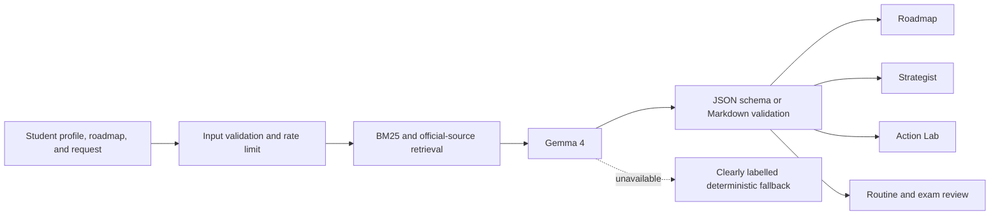

| Product surface | Input given to Gemma 4 | Model responsibility | Validation before display |
| --- | --- | --- | --- |
| Roadmap generation | Student stage, goals, gaps, constraints, and retrieved evidence | Diagnose the profile and produce focused milestones | Shallow JSON schemas, required fields, retry, deterministic assembly |
| Strategist | Profile, live roadmap state, current mission, memory, and top sources | Explain trade-offs and propose the next measurable action | Safe Markdown renderer, citation mapping, formula normalization |
| Research mode | Student question and ranked official evidence | Compare evidence in the student's context | Source allowlist and visible citations |
| Decision Twin | Baseline plan plus one changed constraint | Explain what moves and why | Strict probability, risk, focus, action, and evidence contract |
| Evidence Graph | Claim, proof type, and supplied detail | Identify signal, gap, next action, and verification | Unsupported claims never become verified automatically |
| Mock generation and grading | Exam, official section, difficulty, answers, and validated question set | Create fresh original questions and diagnose the answer pattern | Three-question contract, four-option validation, bounded answer index, deterministic score |
| Smart Routine | Natural-language schedule request and existing blocks | Parse day, time, title, and category | Day and category enums, 24-hour time checks, editable confirmation |
| Video refresh | Exam section and retrieved learning evidence | Curate credible lesson targets and explain relevance | No invented direct URLs; title, channel, reason, and search-query validation |
| Knowledge notes | Student note and optional feedback | Create a compact summary, key concepts, and next actions | Browser-local storage, user deletion, bounded context injection |
| Essay Studio | Prompt, draft, and selected saved notes | Diagnose, outline, or refine while preserving voice | No fabricated achievements, browser autosave, clear ethical boundary |
| Handwriting extraction | Resized JPEG, PNG, or WebP image | Faithfully transcribe Bengali, English, or mixed handwriting | Strict multimodal schema, MIME and size bounds, original-language-first policy, image never stored |
| Essay translation | Reviewed Bengali or mixed transcription | Produce a faithful English version without inventing or improving facts | Separate user-triggered request, editable result, optional save as a new named draft |
| Discovery refresh | Ranked university, resource, or case-study evidence | Synthesize relevant options and specific next actions | No invented rankings, costs, offers, rates, or outcomes |
| Personal Gemma key | Optional tab-scoped credential | Extend a judge or student session using the same Gemma 4 allowlist | Session storage only, never persisted or logged |
| Student offer radar | Retrieved official offer pages | Summarize eligibility and why an offer fits | Official URL validation, timestamps, and visible model trace |
| Student memory | Completed conversation and explicit preferences | Extract durable goals, constraints, and preferences | User-visible memory controls with add, forget, and clear actions |

The enforcement boundary lives in:

- [`lib/llm/gemma.ts`](lib/llm/gemma.ts), which allowlists Gemma 4 model IDs and owns text plus multimodal generation;
- [`lib/llm/providers/registry.ts`](lib/llm/providers/registry.ts), which registers the single generative provider;
- [`lib/llm/router.ts`](lib/llm/router.ts), which rejects unsupported routing choices;
- [`app/api/action-lab/route.ts`](app/api/action-lab/route.ts), which validates every structured Action Lab response;
- [`components/app/MarkdownMessage.tsx`](components/app/MarkdownMessage.tsx), which keeps Markdown, tables, code, and formulas readable.

## Executed Kaggle notebook

[`notebooks/polaris_gemma4_decision_lab.ipynb`](notebooks/polaris_gemma4_decision_lab.ipynb) is a 52-cell, fully executed, judge-readable technical companion to the live app. It includes:

- the fixed Gemma 4 model allowlist and hidden-secret setup;
- inspectable retrieval for a Bangladesh-context student;
- structured Decision Twin and Evidence Graph outputs;
- a Gemma 4 Smart Routine parse;
- live Gemma 4 mock-generation and grading contracts for IELTS and SAT;
- section-aware Gemma 4 video discovery;
- knowledge-note, multi-draft Essay Studio, and image-privacy contracts;
- Bengali structured generation and Bengali-first handwritten essay extraction;
- a 17-surface Gemma 4 responsibility map and provider audit;
- roadmap synthesis and grounded Strategist memory examples;
- Offer Radar provenance and shared conversation-state contracts;
- 18 automated full-project checks with recorded outputs;
- a direct mapping from notebook cells to live product surfaces.

No credential value is stored in the notebook.

## Supporting systems

| Component | Purpose |
| --- | --- |
| Gemma 4 | Central reasoning, planning, synthesis, routine parsing, review, and memory extraction |
| BM25 retrieval | Ranks curated university, scholarship, and admissions evidence |
| Official web retrieval | Supplies current public facts without adding another generative model |
| Transparent scoring | Produces directional university-fit estimates and factor contributions |
| Zod and JSON Schema | Validate public inputs and structured model outputs |
| MongoDB | Stores real account profiles, roadmaps, progress, and conversations |
| Browser-local demo state | Keeps profile, settings, shared Strategist history, memory, and routines functional without authentication |

## Run locally

### Requirements

- Node.js 20 or newer
- pnpm 11 or newer
- a Google AI Studio API key with access to an allowlisted Gemma 4 model

```bash
pnpm install
cp .env.local.example .env.local
pnpm dev
```

On Windows PowerShell, use `Copy-Item .env.local.example .env.local` instead of `cp`.

Set `GEMMA_API_KEY` in `.env.local`, then open [http://localhost:3000/demo](http://localhost:3000/demo).

### Configuration

| Variable | Required | Purpose |
| --- | --- | --- |
| `GEMMA_API_KEY` | For live generation | Server-side Gemma 4 credential |
| `GEMMA_MODEL` | No | Selects a model from the server allowlist |
| `TAVILY_API_KEY` | No | Adds non-generative live-web retrieval in Research mode |
| `MONGODB_URI` | Account workspace only | Profile, roadmap, progress, and conversation storage |
| `NEXTAUTH_SECRET` | Account workspace only | Session security |
| `NEXTAUTH_URL` | Account workspace only | Authentication callback base URL |

The public `/demo` route does not require MongoDB, authentication, or payment configuration.

## Project map

```text
app/demo/                    Public judge workspace
app/api/demo/                Public roadmap and Strategist APIs
app/api/action-lab/          Decision, evidence, and routine contracts
app/api/gemma-studio/       Mock, video, notes, multimodal essay, translation, and discovery contracts
components/app/              Product workspace and model response surfaces
components/demo/             Browser-local public workspace controls
data/                        Curated university, scholarship, and case-study evidence
notebooks/                   Executed Gemma 4 Kaggle notebook
lib/action-lab/              Typed exams, routines, videos, and results
lib/i18n/                    English and Bengali localization
lib/llm/                     Gemma 4 client and routing boundary
lib/ml/                      Transparent admissions-fit scoring
lib/rag/                     Deterministic evidence retrieval
lib/roadmap/                 Roadmap generation, schemas, and state
```

## Validation

```bash
pnpm exec tsc --noEmit
pnpm lint
pnpm build
```

The final responsive check covers live Gemma mock generation, search navigation, family invite creation, the animated roadmap, discovery refresh surfaces, shared Strategist knowledge, 1180px and 1600px layouts, and English/Bengali workspace states.

## Responsible use

Polaris provides planning support, not admission guarantees. Fit estimates are directional. High-stakes decisions should be checked against official university, scholarship, exam, and visa sources. The scoring system excludes demographic proxies, and model responses never expose hidden reasoning.

## Team

**Team name:** Arcane

Built for the **Build with Gemma: ML, AI, Deep Learning & NLP Community Hackathon** in Bangladesh.

- **Imtiaz Hossain**
- **Mofftasim Hossain Sayem**