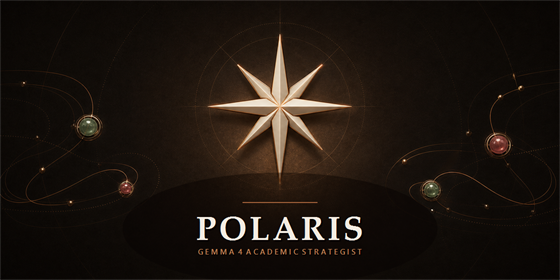
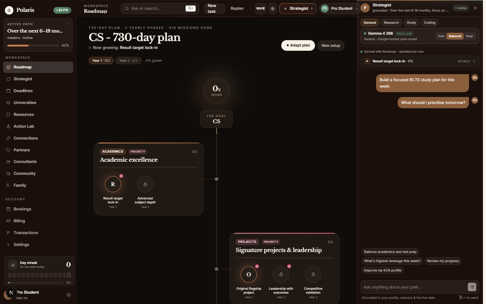
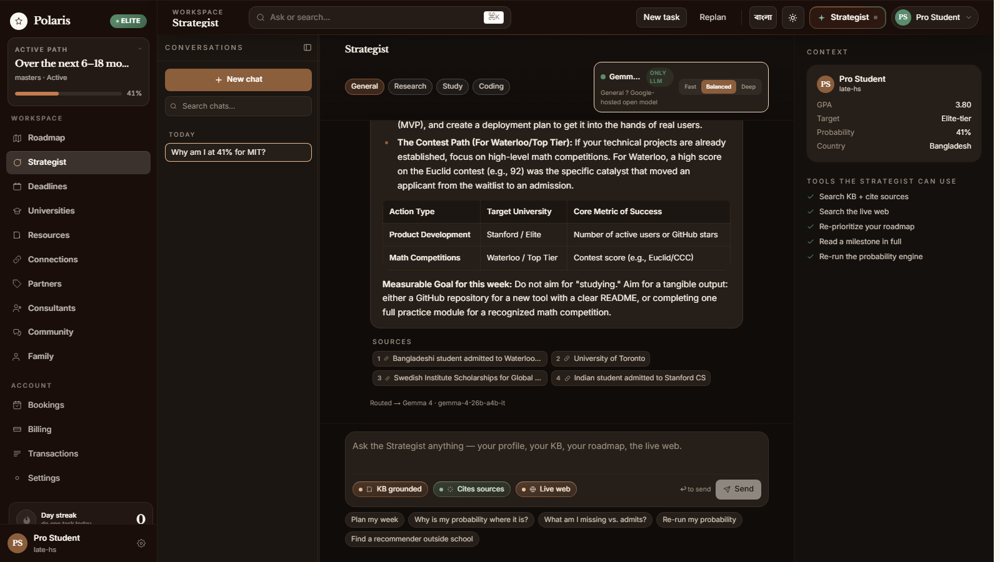
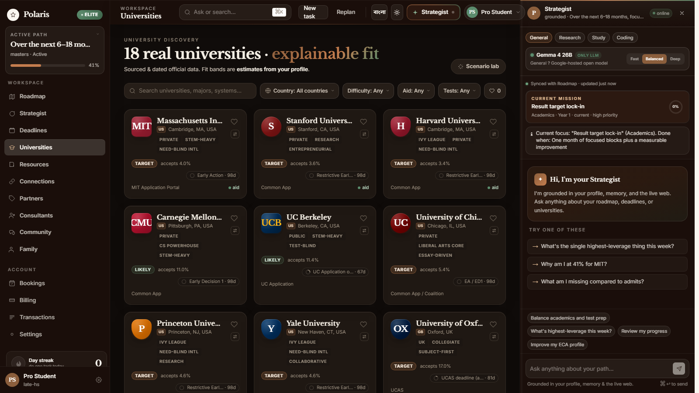
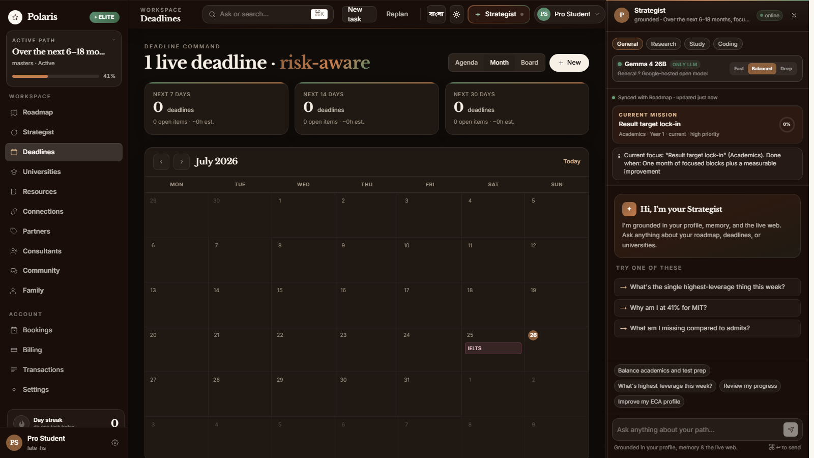
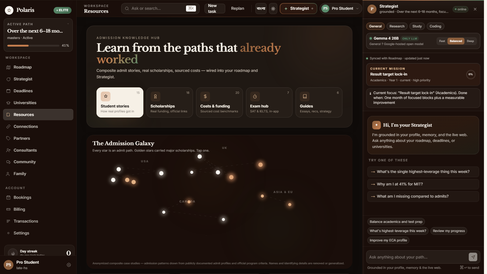
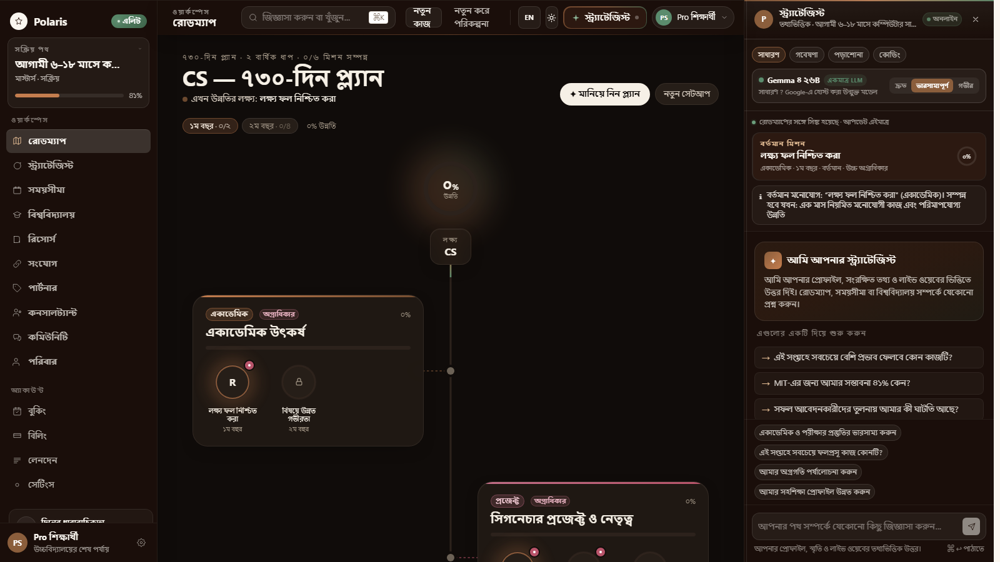
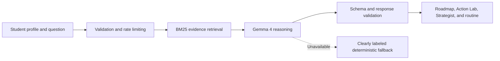

<p align="center">
  
</p>

<h1 align="center">Polaris</h1>

<p align="center">
  A Gemma 4 academic strategist that turns a student's ambition into an evidence-grounded plan they can start this week.
</p>

<p align="center">
  <a href="https://polaris-gemma4.vercel.app/demo">Open the live demo</a>
  ·
  <a href="https://polaris-gemma4.vercel.app/demo/action-lab">Try Action Lab</a>
  ·
  <a href="KAGGLE_WRITEUP.md">Read the project writeup</a>
  ·
  <a href="notebooks/polaris_gemma4_decision_lab.ipynb">Open the executed notebook</a>
  ·
  <a href="docs/ARCHITECTURE.md">Explore the architecture</a>
</p>

## The problem

University applicants rarely lack information. They lack a reliable way to turn scattered requirements, scholarship rules, deadlines, and profile advice into the right next action.

Polaris is built for that planning gap. A student shares their stage, academic position, target degree, activities, and constraints. The system retrieves relevant evidence, asks Gemma 4 to reason over the complete picture, and returns a measurable roadmap instead of generic advice.

The public competition workspace is available without an account, subscription, or payment card. It includes the complete product experience and works in both English and Bengali.

## Product tour

### A living roadmap, not a static checklist



The roadmap connects long-term goals to priorities, milestones, deadlines, and visible evidence of progress. The Strategist stays synchronized with the active mission.

<table>
  <tr>
    <td width="50%">
      
      <br />
      <strong>Gemma 4 Strategist</strong><br />
      Profile-aware guidance, measurable actions, model trace, and retrieved sources.
    </td>
    <td width="50%">
      
      <br />
      <strong>Explainable university fit</strong><br />
      Transparent signals help students build a balanced, realistic university list.
    </td>
  </tr>
  <tr>
    <td width="50%">
      
      <br />
      <strong>Risk-aware deadlines</strong><br />
      Calendar, urgency windows, and task-level tracking in the same workspace.
    </td>
    <td width="50%">
      
      <br />
      <strong>Admission knowledge hub</strong><br />
      Scholarships, costs, exam guidance, and anonymized student paths.
    </td>
  </tr>
</table>

### Built for Bangladeshi students



The interface, roadmap content, error states, fallback guidance, navigation, and Strategist responses support Bengali end to end. Proper names and standard admissions acronyms remain unchanged where translation would reduce clarity.

### Action Lab: decisions become evidence

[Open Action Lab](https://polaris-gemma4.vercel.app/demo/action-lab) to use five connected tools in the same judge workspace:

| Tool | What it does | Gemma 4's role |
| --- | --- | --- |
| Decision Twin | Stress-tests a changed score, deadline, budget, country, or available study time | Rebalances the plan and explains the trade-off |
| Evidence-to-Action Graph | Converts an application claim into proof, a readable signal, a gap, and the next verification step | Audits evidence without treating unsupported claims as facts |
| IELTS and SAT Mock Exams | Runs original English practice questions with immediate scoring | Produces a focused review from the student's answers |
| Smart Routine | Adds, edits, and removes weekly study blocks manually or from natural language | Parses requests such as “Add math practice Monday from 9 to 10 pm” into validated schedule data |
| Video Learning | Embeds official IELTS and SAT lessons and groups related lessons by exam and skill | Deterministic official-source curation avoids inventing resources |

The executed [`polaris_gemma4_decision_lab.ipynb`](notebooks/polaris_gemma4_decision_lab.ipynb) reproduces the Decision Twin and Evidence Graph pipeline with visible model outputs, retrieval results, Bengali generation, and automated engineering checks. No credential value is stored in the notebook.

## How Gemma 4 powers Polaris

Gemma 4 is the only generative model in the application. It is not an optional chat layer: it performs the central planning and synthesis work.



- **Roadmap generation:** Gemma 4 produces a compact diagnosis, then creates eight focused milestones through shallow JSON schemas. Malformed stages receive a targeted retry before deterministic assembly.
- **Strategist guidance:** the model receives the student's profile, current roadmap, workspace context, and top retrieved evidence. It returns readable Markdown, measurable next steps, and source-aware guidance.
- **Research synthesis:** deterministic retrieval supplies facts and candidate evidence; Gemma 4 compares and explains them in the student's context.
- **Student memory:** after a conversation, Gemma 4 can extract durable preferences and commitments so later advice remains consistent.
- **Decision Twin:** Gemma 4 compares a changed constraint with the complete student profile, then returns a compact before/after planning explanation.
- **Evidence Graph:** Gemma 4 separates a student's claim from supplied proof and proposes a measurable verification path.
- **Adaptive exam review:** deterministic scoring stays auditable; Gemma 4 turns incorrect answers into a concise study focus.
- **Natural-language routine:** Gemma 4 converts free-form scheduling requests into a strict day, time, title, and category schema before the user confirms the block.
- **Auditable enforcement:** the server allowlists Gemma 4 model IDs, registers one generative provider, and ignores client-supplied provider choices. If Gemma is unavailable, Polaris never switches to another language model.

The main enforcement points are [`lib/llm/gemma.ts`](lib/llm/gemma.ts), [`lib/llm/providers/registry.ts`](lib/llm/providers/registry.ts), and [`lib/llm/router.ts`](lib/llm/router.ts).

## Supporting systems

| Component | Purpose |
| --- | --- |
| Gemma 4 | Roadmap reasoning, Strategist answers, synthesis, and memory extraction |
| BM25 retrieval | Ranks curated university, scholarship, and admissions evidence |
| Transparent scoring | Produces directional fit estimates and factor contributions |
| Zod and JSON Schema | Validate public inputs and structured model outputs |
| Deterministic planner | Keeps the demo useful during an outage and is always labeled as a fallback |
| MongoDB | Stores profiles, roadmaps, progress, and conversations in the account-backed workspace |

No second language model or generative foundation model is part of the runtime.

## Public demo

Open [polaris-gemma4.vercel.app/demo](https://polaris-gemma4.vercel.app/demo).

The judge workspace includes:

- personalized roadmap and replanning;
- full-page and side-panel Strategist experiences;
- deadlines, university discovery, probability signals, and scenario exploration;
- Decision Twin, Evidence-to-Action Graph, English IELTS/SAT mock exams, Smart Routine, and official video learning;
- resources, scholarships, integrations, partners, consultants, community, and family views;
- complete English and Bengali operation;
- visible Gemma 4 model and retrieval traces;
- full feature access without authentication or payment.

Demo-only account actions are isolated in browser-local state. Real account guards, payment flows, and private data remain separate.

## Run locally

### Requirements

- Node.js 20 or newer
- pnpm 11 or newer
- a Google AI Studio API key with access to an allowlisted Gemma 4 model

```bash
pnpm install
cp .env.local.example .env.local
pnpm dev
```

On Windows PowerShell, use `Copy-Item .env.local.example .env.local` instead of `cp`.

Set `GEMMA_API_KEY` in `.env.local`, then open [http://localhost:3000/demo](http://localhost:3000/demo).

### Configuration

| Variable | Required | Purpose |
| --- | --- | --- |
| `GEMMA_API_KEY` | For live generation | Server-side model credential |
| `GEMMA_MODEL` | No | Selects a Gemma 4 model from the server allowlist |
| `TAVILY_API_KEY` | No | Adds non-generative public-web retrieval in Research mode |
| `MONGODB_URI` | Account workspace only | Profile, roadmap, progress, and conversation storage |
| `NEXTAUTH_SECRET` | Account workspace only | Session security |
| `NEXTAUTH_URL` | Account workspace only | Authentication callback base URL |

The public `/demo` route does not require MongoDB or authentication.

## Project map

```text
app/demo/                    Public, account-free product workspace
app/api/demo/                Rate-limited roadmap and Strategist APIs
app/api/action-lab/          Decision, evidence, exam review, and routine API
app/api/roadmap/             Account-backed roadmap API
components/                  Product interface and interaction components
data/                        Curated university, scholarship, and case-study evidence
notebooks/                   Executed Gemma 4 Kaggle companion notebook
lib/action-lab/              Typed Action Lab contracts, exams, and video catalog
lib/i18n/                    English and Bengali localization
lib/llm/                     Gemma 4 client, provider, and routing boundary
lib/ml/                      Transparent admissions-fit scoring
lib/rag/                     Deterministic BM25 retrieval
lib/roadmap/                 Roadmap generation, schemas, and state logic
docs/ARCHITECTURE.md         Detailed request flow and compliance notes
```

## Validation

```bash
pnpm exec tsc --noEmit
pnpm lint
pnpm build
```

## Responsible use

Polaris provides planning support, not admission guarantees. Fit estimates are directional, and high-stakes decisions should be checked against official university, scholarship, and visa sources. The scoring system excludes demographic proxies, while model responses are grounded in retrieved evidence and never expose hidden reasoning.

## Project

Built for the **Build with Gemma: ML, AI, Deep Learning & NLP Community Hackathon** in Bangladesh.

### Team

- **Imtiaz Hossain**
- **Mofftasim Hossain Sayem**
