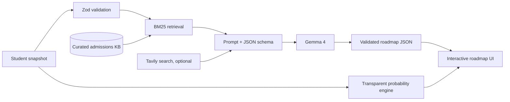

# Polaris - Gemma 4 Academic Strategist

> An evidence-grounded, Bangladesh-aware university admissions copilot powered exclusively by Google DeepMind's open Gemma 4 model.

[Live application](https://polaris-zcq9.vercel.app/) / [Public judge demo](https://polaris-zcq9.vercel.app/demo) / [Public repository](https://github.com/ImtiazHossain-Eshan/polaris-gemma4) / [Kaggle writeup](./KAGGLE_WRITEUP.md) / [Demo script](./DEMO_SCRIPT.md)

## The problem

Ambitious students in Bangladesh can find university requirements online, but turning scattered information into a realistic month-by-month strategy is difficult. Generic advice ignores academic stage, limited local access, scholarship needs, and the difference between being busy and building the signals admissions teams actually evaluate.

Polaris converts a six-field student snapshot into a measurable 6-18 month roadmap. It surfaces profile gaps, retrieves relevant university and scholarship evidence, and recommends concrete actions with success metrics.

## Why Gemma 4 is essential

Gemma 4 is not a decorative chatbot layer. It performs the core judgment that templates cannot:

- interprets an incomplete student profile in context;
- reasons across academic, testing, extracurricular, skills, and application trade-offs;
- synthesizes retrieved evidence into personalized rationales;
- produces schema-constrained JSON that the product can render and track;
- powers the streaming Strategist and durable memory extraction.

The server has a hard allowlist containing only:

- `gemma-4-26b-a4b-it` (default)
- `gemma-4-31b-it` (optional stronger configuration)

The registry contains one generative adapter. Client-supplied provider or model values are ignored. No other LLM or generative foundation model is used. Tavily, when configured, is retrieval only; BM25, probability scoring, and fallback planning are deterministic algorithms.

## Architecture



The competition boundary lives in [`lib/llm/gemma.ts`](./lib/llm/gemma.ts), the sole streaming adapter in [`lib/llm/providers/gemma.ts`](./lib/llm/providers/gemma.ts), and the enforced router in [`lib/llm/router.ts`](./lib/llm/router.ts).

## What works

1. **Public no-login demo** - judges can generate a roadmap at `/demo` without authentication or paid access.
2. **Structured roadmap generation** - 8-12 milestones, honest gaps, priorities, rationales, and measurable outcomes.
3. **Evidence grounding** - deterministic BM25 retrieval over curated university, scholarship, admissions, and case-study documents.
4. **Streaming Strategist** - profile-aware chat with Fast, Balanced, and Deep thinking modes, all mapped to Gemma 4.
5. **Inspectable model trace** - the demo exposes the exact model ID, thinking level, retrieval method, and source policy.
6. **Offline resilience** - if the API is unavailable, a clearly labeled deterministic planner keeps the prototype demonstrable; it is never presented as model output.
7. **Full workspace** - authentication, progress tracking, deadlines, university comparisons, probability scenarios, English/Bangla UI, and family monitoring.

## Run locally

Requirements: Node.js 20+, pnpm 11+, and a Google AI Studio API key with Gemma 4 access.

```bash
pnpm install
cp .env.local.example .env.local
# Set GEMMA_API_KEY in .env.local
pnpm dev
```

Open `http://localhost:3000/demo` for the public competition flow.

The authenticated workspace additionally requires `MONGODB_URI` and `NEXTAUTH_SECRET`. See `.env.local.example` for the complete list.

### Environment variables

| Variable | Required | Purpose |
|---|---:|---|
| `GEMMA_API_KEY` | For AI output | Server-side Google AI Studio credential |
| `GEMMA_MODEL` | No | One of the two whitelisted Gemma 4 IDs |
| `TAVILY_API_KEY` | No | Non-generative public web retrieval |
| `MONGODB_URI` | Workspace only | Profiles, roadmaps, threads, and progress |
| `NEXTAUTH_SECRET` | Workspace only | Authentication session security |

## Verification

```bash
pnpm exec tsc --noEmit
pnpm build
```

Both commands pass in the competition branch. The production build includes `/demo` and `/api/demo` as public routes.

## Repository map

```text
app/demo/                    Public judge experience
app/api/demo/                Rate-limited public generation API
app/api/roadmap/             Authenticated roadmap API
lib/llm/gemma.ts             Gemma 4 allowlist + structured generation
lib/llm/providers/gemma.ts   Sole streaming model adapter
lib/llm/router.ts            Server-enforced Gemma-only routing
lib/rag/search.ts            Deterministic BM25 retrieval
lib/ml/probability.ts        Transparent non-generative scoring
data/                        Curated admissions evidence
docs/ARCHITECTURE.md         Technical design and compliance boundary
KAGGLE_WRITEUP.md            Submission-ready report
DEMO_SCRIPT.md               2-3 minute judging walkthrough
```

## Responsible design

- Advice is guidance, never a guarantee of admission.
- Probability estimates use transparent academic and activity factors, not demographic attributes.
- The public endpoint is validated and rate-limited.
- API keys remain server-side.
- Retrieved evidence is shown so recommendations are inspectable.
- Deterministic fallbacks are explicitly labeled and never impersonate Gemma 4.

## Technology

Next.js 15 / React 19 / TypeScript / Tailwind CSS / `@google/genai` / Gemma 4 / Zod / MongoDB / NextAuth / BM25 retrieval

## Official Gemma references

- [Run Gemma with the Gemini API](https://ai.google.dev/gemma/docs/core/gemma_on_gemini_api)
- [Gemma 4 model overview](https://ai.google.dev/gemma/docs/core)
- [Gemma 4 model card](https://ai.google.dev/gemma/docs/core/model_card_4)

## Team

Built by Imtiaz Hossain Eshan for the Build with Gemma 4 Community Hackathon, Bangladesh.
