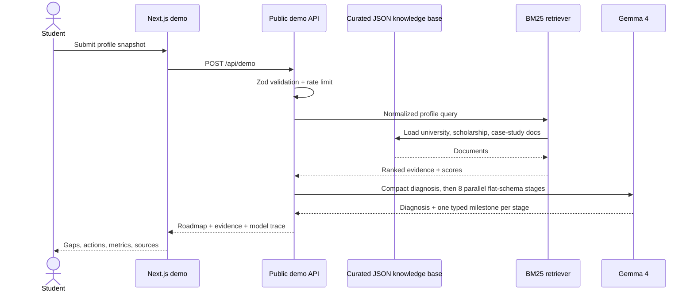
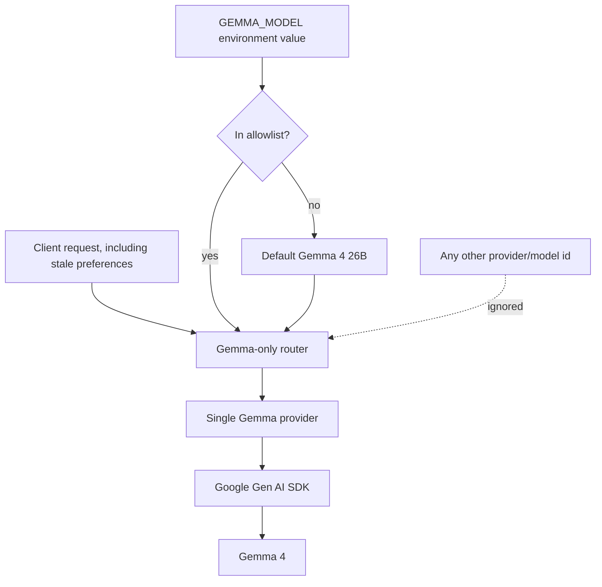

# Technical architecture and Gemma 4 compliance

## Request flow




## Public judge workspace

`/demo` is a separate, account-free product shell. It does not weaken authenticated route guards or paid-plan enforcement. Instead, it provides seeded browser-local state and public, rate-limited Gemma 4 endpoints. The university directory, transparent probability engine, resource hub, and partner matcher reuse the same real datasets and deterministic code as the signed-in product; account-specific writes, real connection grants, invitations, bookings, and payments are simulated locally and clearly labeled.

Public routes include roadmap, Strategist, deadlines, universities, resources, connections, partners, consultants, community, family, bookings, billing, transactions, and settings. The roadmap has useful starter content, so a network interruption never leaves a judge facing an empty screen.

English and Bengali share the same feature set. The browser persists the language preference, public APIs localize generated content and validation states, and the workspace localizer covers remaining product surfaces without translating recognized proper names or admissions acronyms.
## Single-model enforcement

The competition policy is enforced on the server at three layers:

1. `lib/llm/gemma.ts` contains the only permitted model IDs and all non-streaming generation.
2. `lib/llm/providers/registry.ts` registers exactly one provider adapter.
3. `lib/llm/router.ts` ignores legacy client choices and resolves only the Gemma provider and whitelisted environment model.



Allowlisted model IDs:

- `gemma-4-26b-a4b-it`
- `gemma-4-31b-it`

The Google API is the hosting surface for these Gemma models. Credentials are read only on the server. A compatibility environment alias may accept the conventional Google AI Studio key name, but it cannot change the model allowlist.

## Generative versus supporting components

| Component | Type | Role |
|---|---|---|
| Gemma 4 | Generative model | Roadmaps, Strategist answers, grounded synthesis, memory extraction |
| BM25 | Deterministic algorithm | Rank curated evidence |
| Logistic scoring | Traditional ML/math | Directional admissions probability and factor contributions |
| Tavily, optional | Search API | Retrieve public snippets; does not generate answers |
| Zod / JSON Schema | Validation | Constrain inputs and outputs |
| Heuristic planner | Deterministic code | Clearly labeled availability fallback |
| MongoDB | Database | Store profiles, roadmaps, progress, and conversations |

No other LLM or generative foundation model is part of the runtime.

## Structured roadmap contract

The API assembles the following typed contract:

```ts
type RoadmapResponse = {
  summary: string;
  gaps: string[];
  milestones: Array<{
    quarter: string;
    category: "Academics" | "Testing" | "Extracurriculars" | "Skills" | "Applications";
    title: string;
    description: string;
    priority: "high" | "medium" | "low";
    rationale: string;
    metric: string;
  }>;
};
```

The Google Gen AI requests include `responseMimeType: "application/json"` and shallow response schemas. A compact diagnosis is followed by eight one-milestone calls in parallel, then deterministic code assembles and validates the typed contract. Only a malformed stage receives a tiny targeted retry. This avoids long nested-array output while keeping every milestone field schema-constrained.

## Retrieval

`lib/rag/search.ts` implements BM25 directly:

- Unicode-aware tokenization supports English and Bangla text;
- document length normalization reduces long-document bias;
- inverse document frequency emphasizes discriminative terms;
- title matches receive an additional boost;
- rankings and scores are returned in the public trace.

This keeps retrieval reproducible and avoids a second foundation model.

## Thinking modes

Gemma 4 supports high and minimal thinking through the official SDK. Polaris maps:

- **Fast**, **Balanced**, and public roadmap generation - minimal thinking for demo latency;
- **Deep** and complex research - high thinking.

`includeThoughts` is false. Users see conclusions and evidence, never hidden chain-of-thought.

## Failure behavior

If no model key is configured or the hosted request fails:

1. no alternate model is attempted;
2. the API creates a deterministic heuristic roadmap;
3. the response trace says `deterministic-fallback` and model `none`;
4. the interface displays **Offline fallback**, not a Gemma badge.

This improves demo resilience without violating the single-model rule or misleading judges.

## Security and privacy

- Model and search credentials are never shipped to the client.
- Public inputs are schema-validated and rate-limited.
- Authenticated requests use session-bound user IDs.
- Prompts do not require names, email addresses, or demographic traits.
- The probability engine excludes demographic factors.
- Generated advice is framed as guidance, not guaranteed outcomes.
